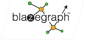

Title: Success Stories
license: https://www.apache.org/licenses/LICENSE-2.0

### Success Stories

#### 

<blockquote>
<small>

The company that I used to work for, Travellinck (a corporate travel
integration and automation tool), uses River in production.

Since 2012, all long-running / reliable processes (e.g. Travel approval,
which has highly flexible rules and per-client integration requirements
into corporate ERP and accounting systems, etc) has been running on a
system that I led the development of. It is implemented according to the
Blackboard pattern, which provides enormous flexibility.

Persistent JavaSpace provides strong reliability in the face of client
and supplier outages, which happen surprisingly frequently. For example,
some of our clients would literally shut their ERP systems down for
backups twice a week, but urgent travel-related approvals happen 24
hours per day via various comms channels: E-mail, Mobile phone text
messages, and the web.

This is still going strong.

It was an interesting journey. River and Rio are wonderful technologies,
but we had our fair share of complexities with the Blackboard pattern
implementation (and how to reason about the resulting business
processes) and, more importantly, we had huge issues from time to time
with the JavaSpace implementation itself.

We started with Persistent Outrigger, and then moved to a port of Blitz
(which has been adapted to be provisioned as a Rio service). It took us
a long time to figure out how to configure Blitz, and how to remove all
"memory leaks" in our process - i.e. Entries that never get cleaned up
over time - to achieve a stable system.

But once stable, this has been running for years with basically no
maintenance

<cite title="Dawid Loubser">
Dawid Loubser
</cite>
</small>
</blockquote>

#### 
Blazegraph™ is a ultra high-performance graph database supporting Apache TinkerPop™ and RDF/SPARQL APIs.
It supports up to 50 Billion edges on a single machine.

#### 
GigaSpaces provides the leading in-memory computing platform for fast data analytics and extreme transaction processing.

#### 

<blockquote>
<small>

 Sucden Financial Limited develops
 its own futures and options trading system called STAR, built
 primarily on the Java and Jini (Apache River) technologies.

 The development of the system began when I joined Sucden almost ten
 years ago, beginning with connection to the Liffe derivatives
 exchange. It soon became the company’s primary trading system, and
 connectivity to the ICE and LME exchanges quickly followed.

 With many local and remote users and ever increasing trading volumes,
 the typically n-tier architecture was difficult to upgrade, suffered
 from problems with scalability and was very susceptible to
 communications failures between it and the exchange host systems.

 In 2006 we started a project to migrate to a service oriented
 architecture, specifically choosing Jini as a 100% Java solution. Jini
 had been around for a long time and I always thought it held great
 promise for our kinds of application, which needed very high
 throughput and fault tolerance – we (myself, Phil Harron and Hector
 Angel), were itching to use it for something useful. We hired IncaX
 consultants Phil Bishop and Nigel Warren to help us get going on the
 project. In 2007, Tom Hobbs and Ian Wood joined us and we began
 building all kinds of service management tools and infrastructure to
 encapsulate the complexities of Jini. A new kind of STAR was finally
 born early in 2009.

 Jini has allowed us to move all our business logic into services,
 allowing for superb scalability, redundant exchange connections, and
 fault tolerant patterns which enable us to upgrade and perform
 maintenance in a live scenario. The system can monitor itself and
 alert support staff of problems automatically.

 To visualize and manage the entire system, we built [an application on
 the Netbeans platform](http://netbeans.dzone.com/nb-financial-management-console)
 where we can immediately see the interaction between services and generally monitor
 the health of the system as a whole. This is an ideal platform on
 which to present the Jini service UIs.

 We are looking forward to upgrading to the Apache River code in 2011
 and hope that the renewed efforts on this open source project will
 help to spread the word about this excellent technology far and wide."

<cite title="Mark Phipps">
Mark Phipps
Front Office Development Manager, Sucden Financial Limited.
</cite>
</small>
</blockquote>

#### Blitz
A performant, persistent implementation of the JavaSpaces API, which is much more suitable for enterprise-grade use
than the (in-memory only) reference implementation, Outrigger [see here](https://github.com/dancres/blitzjavaspaces).

A re-packaging of the Blitz project to build with Maven is available [here](https://github.com/DawidLoubser/blitz-javaspaces-modularised).
 It makes easy to provision a reliable, persistent JavaSpace with Rio.

<!---

#### Glyph
[Glyph](https://glyph.dev.java.net/) is a set of utilities and annotations to speed up development for Jini-enabled applications.
-->

#### Rio
[Rio](http://www.rio-project.org)  is an open source technology that provides a dynamic architecture for developing, deploying and managing distributed systems composed of services.

Rio turns a network of compute resources into a dynamic service, providing a policy based approach for fault detection and recovery, scalability and dynamic deployment. Key to the architecture are a set of dynamic capabilities and reliance on policy-based and SLA mechanisms.

Developing services for use with Rio is simple. Rio provides a non-intrusive model that removes the complexity surrounding service development and deployment.

Key features include:

  1. Dynamic architecture for distributed systems
  1. Built-in fault detection and recovery for your services
  1. Policy based SLA enforcement
  1. Support for external systems, encapsulate the control and monitoring of other frameworks
  1. Built-in support for Maven artifact resolution at deploy time
  1. Extensible service development & deployment support:
      1. POJOs
      1. Spring
      1. Maven based artifact resolution

#### JGDMS - Java Global Discovered Micro Services
The [github code](https://pfirmstone.github.io/JGDMS/) is forked off River trunk, just before the Ivy dependency build
changes and the 3.0 release was branched.

Additions include:

   * Atomic input validation for java serialization
   * IPv6 Multicast Discovery (registered with IANA)
   * TLSv1.2 cyphers with perfect forward secrecy, changes to security constraints, old strong cypers from
   2004 vintage now considered weak, unsafe cyphers have been removed
   * New registrar methods that allow authentication prior to proxy download and delayed unmarshalling, support
   added to ServiceDiscoveryManager without changing public API
   * Improved support for Java 9
   * com.sun.jini compatibility layer (deprecated) API based on Rio's usage
   * Work on Maven modular build is in progress

As soon as River community decides these improvements can be integrated back.

#### Jini Success Stories
 - [Original Jini.org success stories](http://www.jini.org/wiki/Who_uses_Jini%3F), including:
     1. [TNO ICT, The Netherlands](http://www.tno.nl/informatie-_en_communicatietechnologie/)
     1. [European Patent Office, The Netherlands](http://www.epo.org/)
     1. [Magneti Marelli Motorsport, Italy](http://www.magnetimarelli.com/racing/racdwn.htm)
 - [JavaWorld](http://www.javaworld.com/javaworld/jw-10-2001/jw-1005-jiniinterview.html) interview with Dr. Ted Achacoso from GroupServe
 - [Jan Newmarch's Guide to Jini Technologies](http://jan.newmarch.name/java/jini/tutorial/Overview.html#Success%20Stories) contains a section on Jini successes

